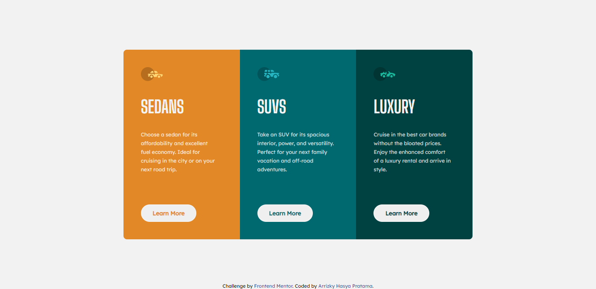

# Frontend Mentor - 3-column preview card component solution

This is a solution to the [3-column preview card component challenge on Frontend Mentor](https://www.frontendmentor.io/challenges/3column-preview-card-component-pH92eAR2-). Frontend Mentor challenges help you improve your coding skills by building realistic projects.

## Table of contents

- [Overview](#overview)
  - [The challenge](#the-challenge)
  - [Screenshot](#screenshot)
  - [Links](#links)
- [My process](#my-process)
  - [Built with](#built-with)
  - [What I learned](#what-i-learned)
  - [Useful resources](#useful-resources)
- [Install](#install)
- [Author](#author)

## Overview

### The challenge

Users should be able to:

- View the optimal layout depending on their device's screen size
- See hover states for interactive elements

### Screenshot


[📱 Mobile Version](./mobile.png)

### Links

- Solution URL: [Solution](https://github.com/arrizkyhp/three-column-preview-card)
- Live Site URL: [Live Site](https://arrizkyhp.github.io/three-column-preview-card/)

## My process

### Built with

- CSS custom properties
- Flexbox
- CSS Grid
- BEM naming
- [Sass](https://sass-lang.com/) - CSS extension
- [GulpJS](https://gulpjs.com/) - JS library
- [ReactJS](https://reactjs.org/) - JS library

### What I learned

This is my first time doing challenge using react but still with Sass and GulpJS, i must say it's hard at the first time but when you get used to it becomes easier and more efficient. I wanna learn more 😁

In this challenge i learn to make different type of button and card with React JS, and them apply it with condition.

```js
if (props.btnOrange) className.push("btn-orange");
if (props.btnCyan) className.push("btn-cyan");
if (props.btnDarkCyan) className.push("btn-dark-cyan");
```

```scss
&.btn-orange {
  color: $bright-orange;
}

&.btn-cyan {
  color: $dark-cyan;
}

&.btn-dark-cyan {
  color: $very-dark-cyan;
}
```

```js
{
  (() => {
    if (props.data.cardColor === "cardOrange") {
      return <Button btnOrange>Learn More</Button>;
    } else if (props.data.cardColor === "cardCyan") {
      return <Button btnCyan>Learn More</Button>;
    } else {
      return <Button btnDarkCyan>Learn More</Button>;
    }
  })();
}
```

## Install

In the project directory, you can run:

### `npm start`

Runs the app in the development mode.\
Open [http://localhost:3000](http://localhost:3000) to view it in the browser.

The page will reload if you make edits.\
You will also see any lint errors in the console.

to start gulp js processing scss run:

### `gulp`

## Author

- Github - [arrizkyhp](https://github.com/arrizkyhp)
- Frontend Mentor - [@arrizkyhp](https://www.frontendmentor.io/profile/arrizkyhp)
- Twitter - [@arrizkyhp](https://twitter.com/arrizkyhp)
